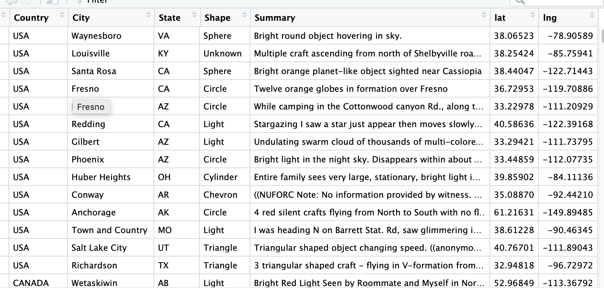
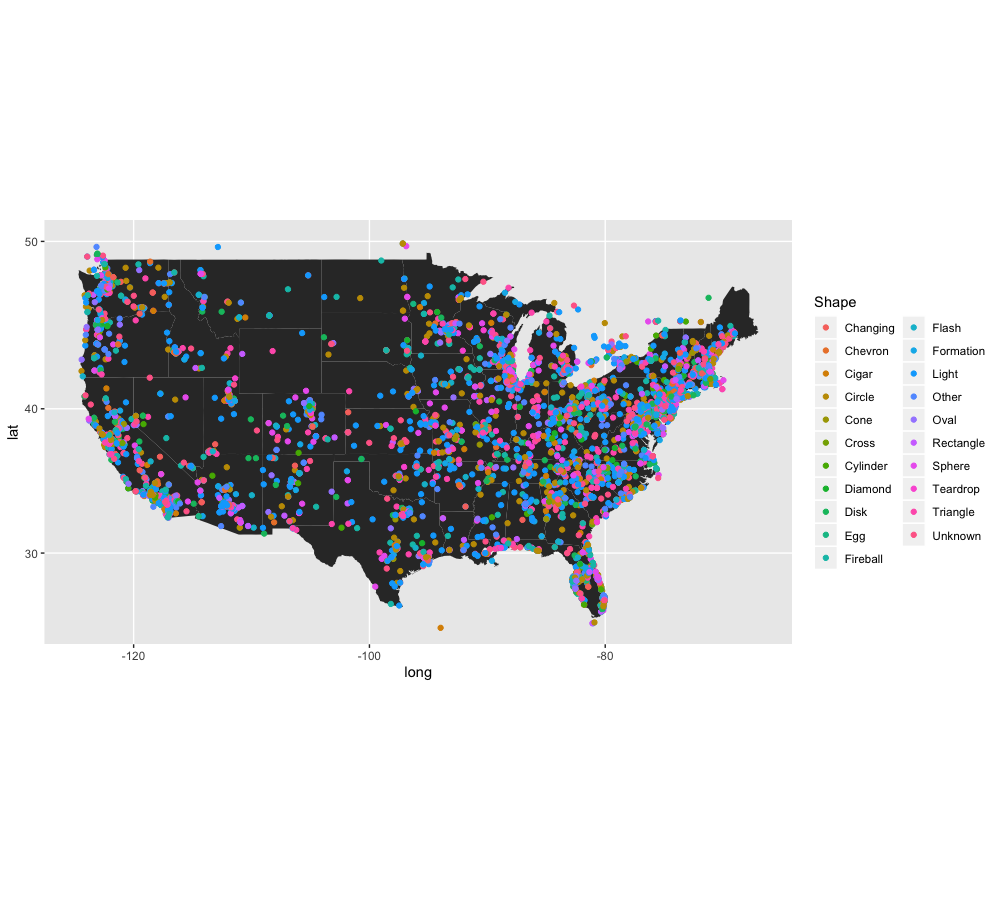

# Do you want to build a dot plot on the US map, which can see the distribution over the states?

With ggplot2 library, we can build amazing visualizations of data. We can build histogram, dot distribution, line graph, and even unique graphs with R! When you have a big data, which gives you latitude and longitude data, you might want to build a dot distribution of the data on the map. For today, I will explain how to make a dot distribution on the U.S map with the data of longitude and latitude. 

Now, I will be using data of occurence of UFO in United States! Here is the data we are looking at :

 

We can see there are both latitude and longitude in our data! Summary part looks all different, so how about looking at distribution of shape of the UFO across United states? The best visualization that fits here is making a US map image and create a dot distribution on that map! It sounds quite complicated, but if you follow the steps, it will end well.

## Set up   

Get the data with both latitude and longitude in it. We are going to use those to plot on the map.
Install `library(ggplot2)`, `library(maps)`, and `library(mapproj)` . Next, we want to read the data first. If it is a csv file, you can read by read.csv code:  
`read.csv()`  
Or if the data is .csv.bz2, install `library(data.table)` and use `fread()` function to unzip :  
  
`data <- paste0("./data/", "UFOCoords.csv.bz2")`  
`data <- data.table::fread(data)`  

Next, we can view the data with using `View(data)` !!  
    
## using dplyr to make my data easier to view and to make a graph!  

Wait... My data is containing not only US, but also Canada. I want my dot districution on the United States map, so some dots will appear out of range if I use this data. However, I can use dplyr to only select US data. Let's use latitude range and longitude range to decide which dots should be shown on our graph.  
United States' latitude range is *20 < latitude < 50*  
United States' longitude range is *-132 < longitude < -69*  
Let's use dplyr function`filter()` to filter out our data!  
`data <- filter(lat > 20 & lat <50) %>% `  
`  filter(long < -69 & long > -132)`  
  
Our data is filtered out! This is extra, but I also want to change column name 'lng' to 'long'.  
I can use `rename()` function to do this.  
`data<- rename(long = lng)`  
  
## Make a Graph with ggplot! 
  
  Now, we can make a graph with our filtered data!  
  First, we can create a U.S map. 
  `state_shape <- map_data("state")`  
  Now we can make a plot! it is easy step.  
  First make a map with the state map, and then put geom_points on the graph using color to   
  distrribute between shapes of the UFO!
   
  
  
  Did it worked? Hopefully it worked!   
  Here is the wonderful graph I got !  
   
